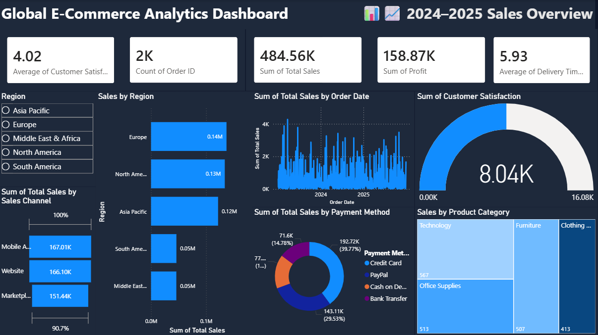

#  Global Ecommerce Sales Power BI Dashboard

An interactive Power BI dashboard designed to analyze global e-commerce sales performance, customer behavior, regional trends, and product insights.

---

## 🚀 Key Features

✨ KPI cards for Sales & Profit
🌎 Regional sales analysis
📦 Product category insights
💳 Payment method analysis
📈 Sales trend visualization
🎛 Interactive slicers and filters

---

## 🛠 Tools & Technologies

🔹 Power BI
🔹 Excel / CSV
🔹 Data Cleaning & Transformation
🔹 Data Visualization

---

## 📷 Dashboard Preview



---

## 📂 Project Structure

```bash
Global-Ecommerce-Sales-PowerBI/
│
├── data/
│   └── data.csv
│
├── docs/
│   └── EcommerceDashboard.pbix
│
├── images/
│   └── dashboard.png
│
└── README.md
```

---

## 📌 Insights Generated

📍 Regional sales performance
📍 Product category contribution
📍 Customer purchasing behavior
📍 Payment method trends
📍 Overall sales & profit analysis

---

## 📁 Files Included

📄 EcommerceDashboard.pbix
📄 data.csv
🖼 dashboard.png

---

## ⭐ Project Goal

To build a clean, interactive, and professional business intelligence dashboard for analyzing global e-commerce data using Power BI.

